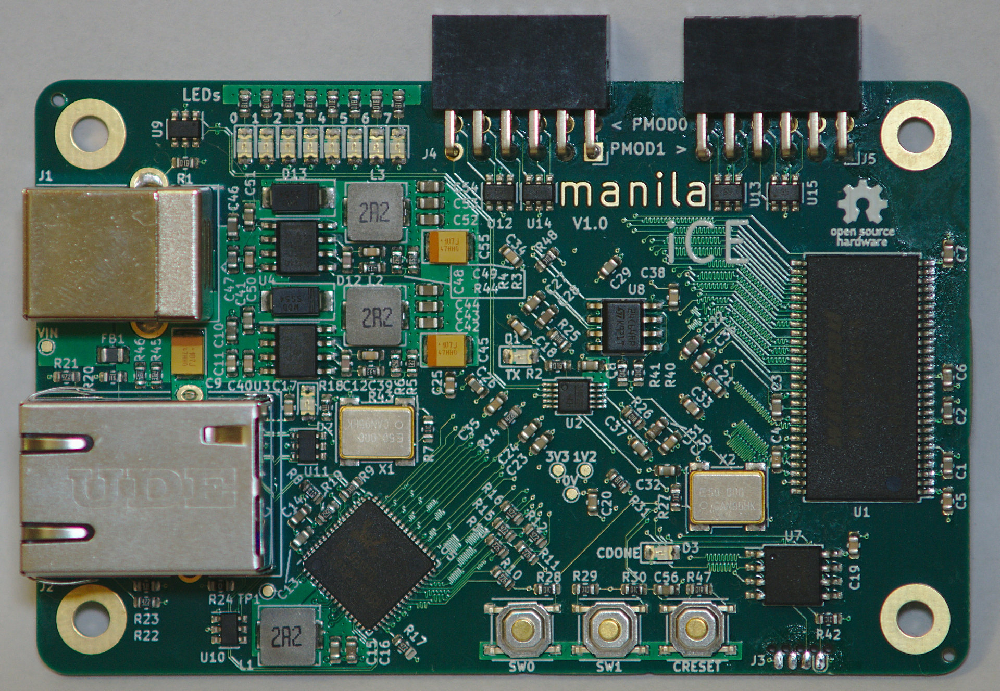

# manila iCE

manila iCE is a credit card sized Lattice iCE40 development board.

Quick links:
* [Schematic](https://github.com/joshtyler/manila-ice/releases/download/hardware_v1.0/manila_ice-schematic.pdf)
* [Gerbers](https://github.com/joshtyler/manila-ice/releases/download/hardware_v1.0/manila_ice-fab.zip)

Features:
* Credit card sized (85x54mm)
* iCE40 HX4K FPGA (usable as an 8k device in yosys)
* Gigabit Ethernet
* 128Mbit SDRAM
* Two dual row PMODs
* 128Mbit QSPI flash
* USB UART (2Mbaud speed)
* 50MHz oscillator
* 64kbit I2C EEPROM
* 8 LEDs
* 2 push buttons
* 3A 3V3 and 1V2 power supplies

## Bootloader

The board has a bootloader which supports loading of FPGA bitstreams over UART. Four slots for bitstreams are supported. The first is reserved for the bootloader itself, and the other three can hold user images.

The FPGA is configured with the bootloader on powerup, and then automatically boots into the first bitstream after a timeout. Alternate bitstreams can be selected using the buttons, or by UART command.

## Example applications

The following applications are provided to demonstrate functionality of the PCB:
* UART loopback
* SDRAM controller
* Gigabit ethernet loopback

## Programming Application

To support uploading user applications, a Linux software utility is provided to update any of the bitstream slots.

To install the software checkout this repository, and run the following commands:
1. `cd sw/scripts`
1. `make`
1. `make install`

You will now have an executable called `manila` in your path.

To program the FPGA:
1. Plug in the board with USB
1. Press either of the switches to pause the boot process (optional if you're quick!)
1. `manila prog [path to bitstream]`

To discover the optional arguments run `manila prog` without any arguments.

## SPI Flash

The SPI flash memory is laid out as follows:

The bootloader partition is protected to prevent accidental erasure.

## Bootloader Upgrades

In order to allow for firmware upgrades the protection is volatile. When the firmware is configured with the bootloader, before UART commands are accpeted it sends commands to the SPI flash to write protect the bootloader region, and then locks out that configuration until the SPI flash is power cycled.

TODO: document process for upgrading bootloader

## PCB Errata
* v1.0 - No known issues affecting functionality
	* LEDs in ethernet phy do not light due to symbol error
	* Silkscreen box around phtograph on back does not fully enclose image after fab
	* Caption for photograph on back is difficult to read
